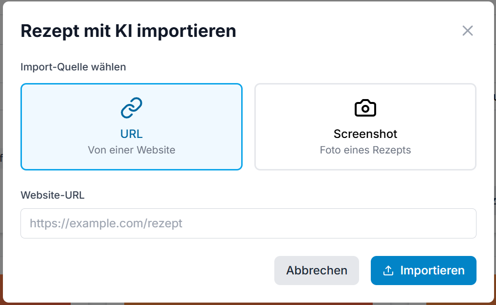
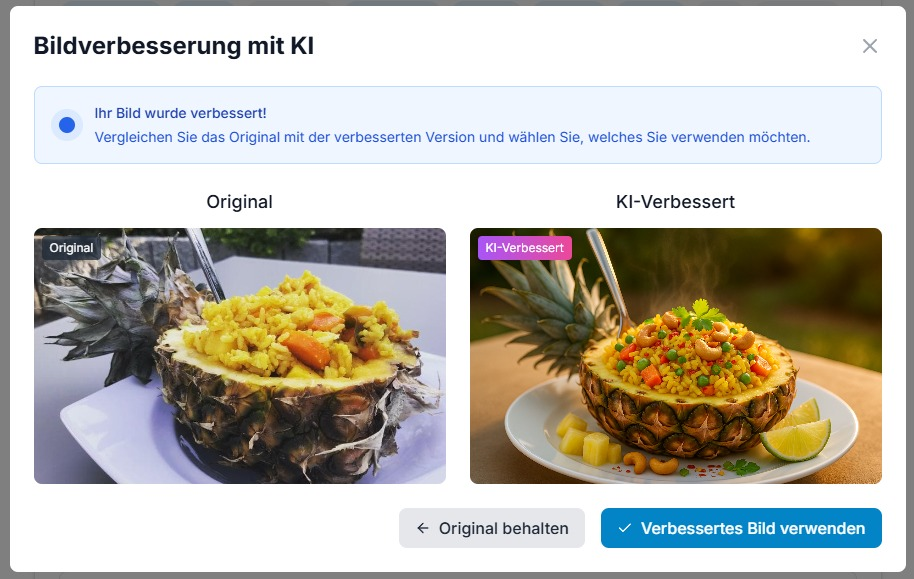

# Essensplan - Familien Essensplaner

Ein moderner, KI-gestützter Essensplaner für Familien, der das Organisieren von Mahlzeiten, das Verwalten von Rezepten und die Wochenplanung vereinfacht.

## Features

### 🍳 Rezeptverwaltung
- **Rezepte erstellen**: Vollständige Rezeptformulare mit Zutaten, Zubereitungsschritten und Bildern
- **Rezepte bearbeiten**: Bestehende Rezepte anpassen und aktualisieren
- **Rezepte durchsuchen**: Filterung nach Kategorien, Tags und Suchbegriffen
- **Rezeptdetails**: Detaillierte Ansicht mit allen Informationen und Zubereitungsschritten

### 📅 Essensplanung
- **Wochenplan**: Visueller Wochenplan mit Drag & Drop Funktionalität
- **Rezepte zuweisen**: Einfaches Hinzufügen von Rezepten zu bestimmten Tagen
- **Plan verwalten**: Rezepte einfach planen, umplanen oder entfernen

### 🛒 Einkaufsliste
- **Einkaufsliste**: Wähle die Rezepte aus, für die du alle Zutaten in einer übersichtlichen Liste angezeigt bekommen möchtest

### 🧙‍♂️ KI Integration
- **Rezepte via URL importieren**: Die KI durchsucht die angegebene URL und extrahiert das Rezept - keine lästige manuelle Arbeit mehr!
- **Rezepte via Foto importieren**: Ein Foto aus dem Kochbuch genügt um das Rezept komplett zu importieren.

- **Rezeptbilder mit KI verbessern**: Ein einfacher Schnappschuss kann mit einem Klick in ein professionelles Bild umgewandelt werden


## 🛠️ Technologie-Stack

- **Frontend**: Next.js 14, React 18, TypeScript
- **Styling**: Tailwind CSS mit benutzerdefinierten Komponenten
- **Datenbank**: PostgreSQL mit Prisma ORM (Supabase)
- **Authentifizierung**: Supabase Auth mit Row Level Security
- **Storage**: Supabase Storage für Rezeptbilder
- **UI-Komponenten**: Headless UI, Heroicons, Lucide React
- **Formulare**: React Hook Form mit Zod-Validierung
- **Benachrichtigungen**: React Hot Toast
- **API**: Supabase Edge Functions
- **KI-Integration**: OpenAI für Rezept-Import

## 🚀 Installation

### Voraussetzungen
- Node.js 18+ 
- npm
- Supabase
- OpenAI API-Key (für AI-Features)

### Setup-Schritte

1. **Repository klonen**
   ```bash
   git clone <repository-url>
   cd essensplan
   ```

2. **Abhängigkeiten installieren**
   ```bash
   npm install
   ```

3. **Umgebungsvariablen konfigurieren**
   Erstellen Sie eine `.env` Datei:
   ```env
   DATABASE_URL="your-postgresql-database-url"
   DIRECT_URL="your-postgresql-direct-url"
   NEXT_PUBLIC_SUPABASE_URL="your-supabase-url"
   NEXT_PUBLIC_SUPABASE_ANON_KEY="your-supabase-anon-key"
   OPENAI_API_KEY="your-openai-api-key"
   ```

4. **Datenbank einrichten**
   ```bash
   # Schema zur Datenbank pushen
   npx prisma db push
   # Prisma Studio öffnen (für Datenbank-Management)
   npx prisma studio
   # Datenbank-Status prüfen
   npx prisma db pull
   # Migration erstellen (falls nötig)
   npx prisma migrate dev --name init

   # Create types for supabase client
   npx supabase gen types typescript --project-id <project-id> --schema public > lib/database.types.ts
   ```

5. **Entwicklungsserver starten**
   ```bash
   npm run dev
   ```

6. **Supabase Funktionen lokal testen**
   ```bash
   npx supabase start
   npx supabase functions serve --env-file .env
   ```

## Entwicklung

### Wichtige NPM Skripte
- `npm run dev` - Entwicklungsserver starten (http://localhost:3000)
- `npm run build` - Produktionsbuild erstellen
- `npm run start` - Produktionsserver starten
- `npm run lint` - ESLint Code-Linting durchführen

### Datenbank-Skripte
- `npm run db:generate` - Prisma Client nach Schema-Änderungen generieren
- `npm run db:push` - Prisma Schema-Änderungen zur Datenbank pushen
- `npm run db:studio` - Prisma Studio für Datenbank-Management öffnen
- `npx prisma db pull` - Datenbankschema-Änderungen pullen
- `npx prisma migrate dev --name <name>` - Neue Migration erstellen und anwenden

### Ordnerstruktur
```
essensplan/
├── app/                   # Next.js App Router Seiten
│   ├── meal-plan/         # Wochenplanung
│   ├── recipes/           # Rezeptverwaltung
│   ├── grocery-list/      # Einkaufsliste
│   ├── globals.css        # Globale Styles
│   ├── layout.tsx         # Root Layout
│   └── page.tsx           # Startseite
├── components/            # React-Komponenten
│   ├── AIImportModal.tsx  # AI Import Modal
│   ├── AuthProvider.tsx   # Authentifizierung Context
│   ├── Navigation.tsx     # Hauptnavigation
│   ├── RecipeForm.tsx     # Rezeptformular
│   └── ...                # Weitere Komponenten
├── lib/                   # Utility-Funktionen
│   ├── database.types.ts  # Supabase TypeScript Typen
│   └── supabase.ts        # Supabase Client
├── prisma/
│   └── schema.prisma      # Prisma Schema
└── supabase/
    └── functions/         # Supabase Edge Functions
```

## Deployment

### Produktionsumgebung einrichten

1. **Supabase Projekt erstellen**
   - Dem [Guide](./SUPABASE_SETUP.md) folgen

2. **Optional: OpenAI API Key erstellen (kostenpflichtig)**

2. **Umgebungsvariablen für Produktion**
   ```env
   DATABASE_URL="postgresql://[user]:[password]@[host]/[database]"
   DIRECT_URL="postgresql://[user]:[password]@[host]/[database]"
   NEXT_PUBLIC_SUPABASE_URL="https://your-project.supabase.co"
   NEXT_PUBLIC_SUPABASE_ANON_KEY="your-anon-key"
   OPENAI_API_KEY="your-openai-api-key"
   ```

3. **Datenbank-Migration**
   ```bash
   # Schema zur Produktionsdatenbank migrieren
   npx prisma migrate deploy
   
   # RLS Policies in Supabase einrichten (über Supabase Dashboard)
   ```

4. **Deployment**
   - **Vercel** (empfohlen): `npm run build` und automatisches Deployment

### Produktions-Checkliste
- [ ] Alle Umgebungsvariablen konfiguriert
- [ ] Datenbank-Migrationen angewendet
- [ ] Row Level Security (RLS) Policies aktiviert
- [ ] Supabase Storage Buckets eingerichtet
- [ ] Supabase Functions deployed (optional)
- [ ] OpenAI API-Key für AI-Import konfiguriert (optional)
- [ ] Build erfolgreich durchgeführt (`npm run build`)
- [ ] Linting ohne Fehler (`npm run lint`)

---

**Coded with ❤️ in THE LÄND.**
